# Wizard Adventures Sprite Asset Audit

Generated by `python scripts/audit_sprites.py`.

This report flags measurable crop and alignment issues. It cannot prove that anatomy is artistically correct; frames with missing feet or body parts usually show up as edge-contact or tiny-margin warnings.

## Summary

- Files scanned: 84
- High priority: 15
- Medium priority: 9
- Low priority: 35
- No automatic warnings: 25

## HIGH Priority

### `assets/enemies/cursed_book/angry_idle.png`

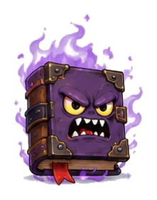

- Group: `enemies/cursed_book/angry_idle`
- Canvas: 185x243
- Opaque bounds: (2, 0, 182, 240)
- Margins: left:2, right:2, top:0, bottom:2
- Warnings:
  - only 2px margin on left edge
  - only 2px margin on right edge
  - opaque pixels touch top edge
  - only 2px margin on bottom edge

### `assets/enemies/cursed_scroll_rocket/launcher.png`

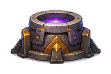

- Group: `enemies/cursed_scroll_rocket/launcher`
- Canvas: 157x99
- Opaque bounds: (0, 0, 156, 98)
- Margins: left:0, right:0, top:0, bottom:0
- Warnings:
  - opaque pixels touch left edge
  - opaque pixels touch right edge
  - opaque pixels touch top edge
  - opaque pixels touch bottom edge

### `assets/enemies/cursed_scroll_rocket/rocket_01.png`

- Group: `enemies/cursed_scroll_rocket/rocket`
- Canvas: 186x215
- Opaque bounds: (0, 0, 185, 214)
- Margins: left:0, right:0, top:0, bottom:0
- Warnings:
  - opaque pixels touch left edge
  - opaque pixels touch right edge
  - opaque pixels touch top edge
  - opaque pixels touch bottom edge
  - group canvas sizes differ: [186, 208] x [215, 248]
  - baseline differs from group median by -16.5px
  - horizontal center differs from group median by -5.5px

### `assets/enemies/cursed_scroll_rocket/rocket_02.png`

- Group: `enemies/cursed_scroll_rocket/rocket`
- Canvas: 208x248
- Opaque bounds: (0, 0, 207, 247)
- Margins: left:0, right:0, top:0, bottom:0
- Warnings:
  - opaque pixels touch left edge
  - opaque pixels touch right edge
  - opaque pixels touch top edge
  - opaque pixels touch bottom edge
  - group canvas sizes differ: [186, 208] x [215, 248]
  - baseline differs from group median by +16.5px
  - horizontal center differs from group median by +5.5px

### `assets/enemies/goblin_spell_thrower/hurt.png`

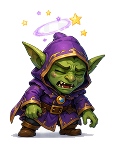

- Group: `enemies/goblin_spell_thrower/hurt`
- Canvas: 197x261
- Opaque bounds: (0, 0, 196, 260)
- Margins: left:0, right:0, top:0, bottom:0
- Warnings:
  - opaque pixels touch left edge
  - opaque pixels touch right edge
  - opaque pixels touch top edge
  - opaque pixels touch bottom edge

### `assets/enemies/goblin_spell_thrower/idle.png`

- Group: `enemies/goblin_spell_thrower/idle`
- Canvas: 215x228
- Opaque bounds: (0, 0, 214, 227)
- Margins: left:0, right:0, top:0, bottom:0
- Warnings:
  - opaque pixels touch left edge
  - opaque pixels touch right edge
  - opaque pixels touch top edge
  - opaque pixels touch bottom edge

### `assets/enemies/goblin_spell_thrower/jump.png`

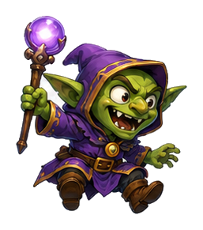

- Group: `enemies/goblin_spell_thrower/jump`
- Canvas: 250x251
- Opaque bounds: (0, 0, 249, 250)
- Margins: left:0, right:0, top:0, bottom:0
- Warnings:
  - opaque pixels touch left edge
  - opaque pixels touch right edge
  - opaque pixels touch top edge
  - opaque pixels touch bottom edge

### `assets/enemies/goblin_spell_thrower/orb_01.png`

- Group: `enemies/goblin_spell_thrower/orb`
- Canvas: 149x94
- Opaque bounds: (0, 0, 148, 93)
- Margins: left:0, right:0, top:0, bottom:0
- Warnings:
  - opaque pixels touch left edge
  - opaque pixels touch right edge
  - opaque pixels touch top edge
  - opaque pixels touch bottom edge
  - group canvas sizes differ: [149, 222] x [94, 98]
  - horizontal center differs from group median by -18.2px

### `assets/enemies/goblin_spell_thrower/orb_02.png`

- Group: `enemies/goblin_spell_thrower/orb`
- Canvas: 222x98
- Opaque bounds: (0, 0, 221, 97)
- Margins: left:0, right:0, top:0, bottom:0
- Warnings:
  - opaque pixels touch left edge
  - opaque pixels touch right edge
  - opaque pixels touch top edge
  - opaque pixels touch bottom edge
  - group canvas sizes differ: [149, 222] x [94, 98]
  - horizontal center differs from group median by +18.2px

### `assets/enemies/goblin_spell_thrower/throw.png`

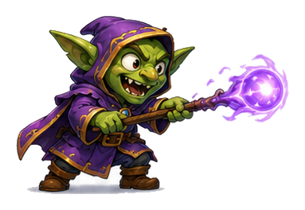

- Group: `enemies/goblin_spell_thrower/throw`
- Canvas: 284x221
- Opaque bounds: (0, 0, 283, 220)
- Margins: left:0, right:0, top:0, bottom:0
- Warnings:
  - opaque pixels touch left edge
  - opaque pixels touch right edge
  - opaque pixels touch top edge
  - opaque pixels touch bottom edge

### `assets/enemies/owl_helper/flap_01.png`

- Group: `enemies/owl_helper/flap`
- Canvas: 223x176
- Opaque bounds: (0, 0, 222, 175)
- Margins: left:0, right:0, top:0, bottom:0
- Warnings:
  - opaque pixels touch left edge
  - opaque pixels touch right edge
  - opaque pixels touch top edge
  - opaque pixels touch bottom edge
  - group canvas sizes differ: [223, 263] x [162, 176]
  - baseline differs from group median by +7.0px
  - horizontal center differs from group median by -10.0px

### `assets/enemies/owl_helper/flap_02.png`

- Group: `enemies/owl_helper/flap`
- Canvas: 263x162
- Opaque bounds: (0, 0, 262, 161)
- Margins: left:0, right:0, top:0, bottom:0
- Warnings:
  - opaque pixels touch left edge
  - opaque pixels touch right edge
  - opaque pixels touch top edge
  - opaque pixels touch bottom edge
  - group canvas sizes differ: [223, 263] x [162, 176]
  - baseline differs from group median by -7.0px
  - horizontal center differs from group median by +10.0px

### `assets/enemies/owl_helper/hint_sign.png`

- Group: `enemies/owl_helper/hint_sign`
- Canvas: 226x215
- Opaque bounds: (0, 0, 225, 214)
- Margins: left:0, right:0, top:0, bottom:0
- Warnings:
  - opaque pixels touch left edge
  - opaque pixels touch right edge
  - opaque pixels touch top edge
  - opaque pixels touch bottom edge

### `assets/enemies/owl_helper/perched.png`

- Group: `enemies/owl_helper/perched`
- Canvas: 169x205
- Opaque bounds: (0, 0, 168, 204)
- Margins: left:0, right:0, top:0, bottom:0
- Warnings:
  - opaque pixels touch left edge
  - opaque pixels touch right edge
  - opaque pixels touch top edge
  - opaque pixels touch bottom edge

### `assets/enemies/owl_helper/point.png`

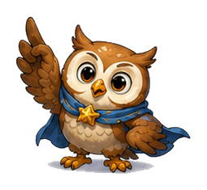

- Group: `enemies/owl_helper/point`
- Canvas: 223x194
- Opaque bounds: (0, 0, 222, 193)
- Margins: left:0, right:0, top:0, bottom:0
- Warnings:
  - opaque pixels touch left edge
  - opaque pixels touch right edge
  - opaque pixels touch top edge
  - opaque pixels touch bottom edge

## MEDIUM Priority

### `assets/characters/finn/baby_run_02.png`

- Group: `characters/finn/baby/run`
- Canvas: 168x192
- Opaque bounds: (12, 20, 147, 171)
- Margins: left:12, right:20, top:20, bottom:20
- Warnings:
  - group canvas sizes differ: [168, 174, 178] x [186, 192, 195]
  - horizontal center differs from group median by -6.5px

### `assets/characters/finn/baby_run_03.png`

- Group: `characters/finn/baby/run`
- Canvas: 178x186
- Opaque bounds: (20, 20, 157, 165)
- Margins: left:20, right:20, top:20, bottom:20
- Warnings:
  - group canvas sizes differ: [168, 174, 178] x [186, 192, 195]
  - baseline differs from group median by -6.0px

### `assets/characters/finn/old_run_03.png`

- Group: `characters/finn/old/run`
- Canvas: 184x233
- Opaque bounds: (20, 20, 165, 212)
- Margins: left:20, right:18, top:20, bottom:20
- Warnings:
  - group canvas sizes differ: [184, 201, 202] x [233, 238]
  - baseline differs from group median by -5.0px

### `assets/characters/finn/white_run_03.png`

- Group: `characters/finn/white/run`
- Canvas: 153x201
- Opaque bounds: (12, 20, 133, 180)
- Margins: left:12, right:19, top:20, bottom:20
- Warnings:
  - group canvas sizes differ: [153, 187] x [201, 204]
  - horizontal center differs from group median by -20.5px

### `assets/characters/nora/old_run_01.png`

- Group: `characters/nora/old/run`
- Canvas: 196x227
- Opaque bounds: (20, 20, 179, 206)
- Margins: left:20, right:16, top:20, bottom:20
- Warnings:
  - group canvas sizes differ: [181, 184, 196] x [220, 227, 231]
  - horizontal center differs from group median by +6.0px

### `assets/characters/nora/old_run_02.png`

- Group: `characters/nora/old/run`
- Canvas: 184x220
- Opaque bounds: (17, 20, 167, 199)
- Margins: left:17, right:16, top:20, bottom:20
- Warnings:
  - group canvas sizes differ: [181, 184, 196] x [220, 227, 231]
  - baseline differs from group median by -7.0px

### `assets/characters/nora/old_run_03.png`

- Group: `characters/nora/old/run`
- Canvas: 181x231
- Opaque bounds: (19, 20, 168, 210)
- Margins: left:19, right:12, top:20, bottom:20
- Warnings:
  - group canvas sizes differ: [181, 184, 196] x [220, 227, 231]
  - baseline differs from group median by +4.0px

### `assets/enemies/snapping_vine/rise_01.png`

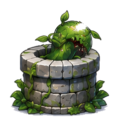

- Group: `enemies/snapping_vine/rise`
- Canvas: 203x219
- Opaque bounds: (2, 2, 200, 216)
- Margins: left:2, right:2, top:2, bottom:2
- Warnings:
  - only 2px margin on left edge
  - only 2px margin on right edge
  - only 2px margin on top edge
  - only 2px margin on bottom edge
  - group canvas sizes differ: [201, 203] x [219, 277]
  - baseline differs from group median by -29.0px

### `assets/enemies/snapping_vine/rise_02.png`

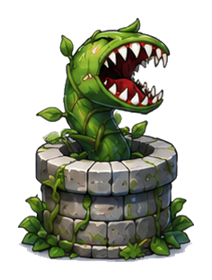

- Group: `enemies/snapping_vine/rise`
- Canvas: 201x277
- Opaque bounds: (2, 2, 198, 274)
- Margins: left:2, right:2, top:2, bottom:2
- Warnings:
  - only 2px margin on left edge
  - only 2px margin on right edge
  - only 2px margin on top edge
  - only 2px margin on bottom edge
  - group canvas sizes differ: [201, 203] x [219, 277]
  - baseline differs from group median by +29.0px

## LOW Priority

### `assets/characters/finn/baby_idle_01.png`

- Group: `characters/finn/baby/idle`
- Canvas: 127x208
- Opaque bounds: (20, 20, 107, 187)
- Margins: left:20, right:19, top:20, bottom:20
- Warnings:
  - group canvas sizes differ: [127, 128] x [208]

### `assets/characters/finn/baby_idle_02.png`

- Group: `characters/finn/baby/idle`
- Canvas: 128x208
- Opaque bounds: (20, 20, 107, 187)
- Margins: left:20, right:20, top:20, bottom:20
- Warnings:
  - group canvas sizes differ: [127, 128] x [208]

### `assets/characters/finn/baby_run_01.png`

- Group: `characters/finn/baby/run`
- Canvas: 174x195
- Opaque bounds: (19, 20, 153, 174)
- Margins: left:19, right:20, top:20, bottom:20
- Warnings:
  - group canvas sizes differ: [168, 174, 178] x [186, 192, 195]

### `assets/characters/finn/old_idle_01.png`

- Group: `characters/finn/old/idle`
- Canvas: 170x249
- Opaque bounds: (20, 20, 157, 228)
- Margins: left:20, right:12, top:20, bottom:20
- Warnings:
  - group canvas sizes differ: [170, 178] x [249, 252]

### `assets/characters/finn/old_idle_02.png`

- Group: `characters/finn/old/idle`
- Canvas: 178x252
- Opaque bounds: (12, 20, 157, 231)
- Margins: left:12, right:20, top:20, bottom:20
- Warnings:
  - group canvas sizes differ: [170, 178] x [249, 252]

### `assets/characters/finn/old_run_01.png`

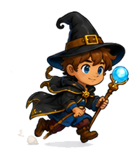

- Group: `characters/finn/old/run`
- Canvas: 202x238
- Opaque bounds: (12, 20, 182, 217)
- Margins: left:12, right:19, top:20, bottom:20
- Warnings:
  - group canvas sizes differ: [184, 201, 202] x [233, 238]

### `assets/characters/finn/old_run_02.png`

- Group: `characters/finn/old/run`
- Canvas: 201x238
- Opaque bounds: (16, 20, 183, 217)
- Margins: left:16, right:17, top:20, bottom:20
- Warnings:
  - group canvas sizes differ: [184, 201, 202] x [233, 238]

### `assets/characters/finn/white_idle_01.png`

- Group: `characters/finn/white/idle`
- Canvas: 174x220
- Opaque bounds: (19, 20, 156, 199)
- Margins: left:19, right:17, top:20, bottom:20
- Warnings:
  - group canvas sizes differ: [170, 174] x [220, 222]

### `assets/characters/finn/white_idle_02.png`

- Group: `characters/finn/white/idle`
- Canvas: 170x222
- Opaque bounds: (18, 20, 157, 201)
- Margins: left:18, right:12, top:20, bottom:20
- Warnings:
  - group canvas sizes differ: [170, 174] x [220, 222]

### `assets/characters/finn/white_run_01.png`

- Group: `characters/finn/white/run`
- Canvas: 187x204
- Opaque bounds: (12, 20, 174, 183)
- Margins: left:12, right:12, top:20, bottom:20
- Warnings:
  - group canvas sizes differ: [153, 187] x [201, 204]

### `assets/characters/finn/white_run_02.png`

- Group: `characters/finn/white/run`
- Canvas: 187x201
- Opaque bounds: (12, 20, 174, 180)
- Margins: left:12, right:12, top:20, bottom:20
- Warnings:
  - group canvas sizes differ: [153, 187] x [201, 204]

### `assets/characters/nora/baby_idle_01.png`

- Group: `characters/nora/baby/idle`
- Canvas: 150x195
- Opaque bounds: (20, 20, 129, 174)
- Margins: left:20, right:20, top:20, bottom:20
- Warnings:
  - group canvas sizes differ: [147, 150] x [195]

### `assets/characters/nora/baby_idle_02.png`

- Group: `characters/nora/baby/idle`
- Canvas: 147x195
- Opaque bounds: (20, 20, 126, 174)
- Margins: left:20, right:20, top:20, bottom:20
- Warnings:
  - group canvas sizes differ: [147, 150] x [195]

### `assets/characters/nora/baby_run_01.png`

- Group: `characters/nora/baby/run`
- Canvas: 147x189
- Opaque bounds: (20, 20, 126, 168)
- Margins: left:20, right:20, top:20, bottom:20
- Warnings:
  - group canvas sizes differ: [147, 155, 156] x [189, 191]

### `assets/characters/nora/baby_run_02.png`

- Group: `characters/nora/baby/run`
- Canvas: 155x191
- Opaque bounds: (20, 20, 134, 170)
- Margins: left:20, right:20, top:20, bottom:20
- Warnings:
  - group canvas sizes differ: [147, 155, 156] x [189, 191]

### `assets/characters/nora/baby_run_03.png`

- Group: `characters/nora/baby/run`
- Canvas: 156x191
- Opaque bounds: (20, 20, 135, 170)
- Margins: left:20, right:20, top:20, bottom:20
- Warnings:
  - group canvas sizes differ: [147, 155, 156] x [189, 191]

### `assets/characters/nora/old_idle_01.png`

- Group: `characters/nora/old/idle`
- Canvas: 172x229
- Opaque bounds: (20, 20, 151, 208)
- Margins: left:20, right:20, top:20, bottom:20
- Warnings:
  - group canvas sizes differ: [172, 174] x [229, 232]

### `assets/characters/nora/old_idle_02.png`

- Group: `characters/nora/old/idle`
- Canvas: 174x232
- Opaque bounds: (20, 20, 154, 211)
- Margins: left:20, right:19, top:20, bottom:20
- Warnings:
  - group canvas sizes differ: [172, 174] x [229, 232]

### `assets/characters/nora/white_idle_01.png`

- Group: `characters/nora/white/idle`
- Canvas: 184x211
- Opaque bounds: (20, 20, 171, 190)
- Margins: left:20, right:12, top:20, bottom:20
- Warnings:
  - group canvas sizes differ: [174, 184] x [211, 212]

### `assets/characters/nora/white_idle_02.png`

- Group: `characters/nora/white/idle`
- Canvas: 174x212
- Opaque bounds: (12, 20, 161, 191)
- Margins: left:12, right:12, top:20, bottom:20
- Warnings:
  - group canvas sizes differ: [174, 184] x [211, 212]

### `assets/characters/nora/white_run_01.png`

- Group: `characters/nora/white/run`
- Canvas: 180x209
- Opaque bounds: (12, 20, 167, 188)
- Margins: left:12, right:12, top:20, bottom:20
- Warnings:
  - group canvas sizes differ: [180, 181, 189] x [205, 207, 209]

### `assets/characters/nora/white_run_02.png`

- Group: `characters/nora/white/run`
- Canvas: 189x205
- Opaque bounds: (12, 20, 176, 184)
- Margins: left:12, right:12, top:20, bottom:20
- Warnings:
  - group canvas sizes differ: [180, 181, 189] x [205, 207, 209]

### `assets/characters/nora/white_run_03.png`

- Group: `characters/nora/white/run`
- Canvas: 181x207
- Opaque bounds: (12, 20, 168, 186)
- Margins: left:12, right:12, top:20, bottom:20
- Warnings:
  - group canvas sizes differ: [180, 181, 189] x [205, 207, 209]

### `assets/enemies/armored_beetle/flipped.png`

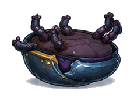

- Group: `enemies/armored_beetle/flipped`
- Canvas: 194x138
- Opaque bounds: (2, 2, 191, 135)
- Margins: left:2, right:2, top:2, bottom:2
- Warnings:
  - only 2px margin on left edge
  - only 2px margin on right edge
  - only 2px margin on top edge
  - only 2px margin on bottom edge

### `assets/enemies/armored_beetle/shell.png`

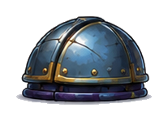

- Group: `enemies/armored_beetle/shell`
- Canvas: 177x115
- Opaque bounds: (2, 2, 174, 112)
- Margins: left:2, right:2, top:2, bottom:2
- Warnings:
  - only 2px margin on left edge
  - only 2px margin on right edge
  - only 2px margin on top edge
  - only 2px margin on bottom edge

### `assets/enemies/armored_beetle/slide.png`

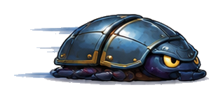

- Group: `enemies/armored_beetle/slide`
- Canvas: 293x106
- Opaque bounds: (2, 2, 290, 103)
- Margins: left:2, right:2, top:2, bottom:2
- Warnings:
  - only 2px margin on left edge
  - only 2px margin on right edge
  - only 2px margin on top edge
  - only 2px margin on bottom edge

### `assets/enemies/armored_beetle/walk_01.png`

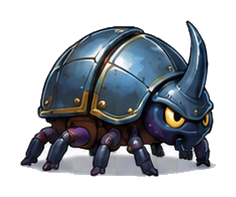

- Group: `enemies/armored_beetle/walk`
- Canvas: 203x161
- Opaque bounds: (2, 2, 200, 158)
- Margins: left:2, right:2, top:2, bottom:2
- Warnings:
  - only 2px margin on left edge
  - only 2px margin on right edge
  - only 2px margin on top edge
  - only 2px margin on bottom edge
  - group canvas sizes differ: [203, 206] x [156, 161]

### `assets/enemies/armored_beetle/walk_02.png`

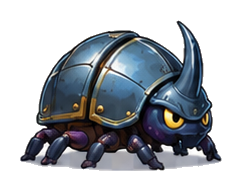

- Group: `enemies/armored_beetle/walk`
- Canvas: 206x156
- Opaque bounds: (2, 2, 203, 153)
- Margins: left:2, right:2, top:2, bottom:2
- Warnings:
  - only 2px margin on left edge
  - only 2px margin on right edge
  - only 2px margin on top edge
  - only 2px margin on bottom edge
  - group canvas sizes differ: [203, 206] x [156, 161]

### `assets/enemies/cursed_book/fireball_hit.png`

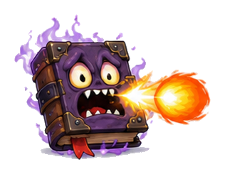

- Group: `enemies/cursed_book/fireball_hit`
- Canvas: 280x209
- Opaque bounds: (2, 2, 277, 206)
- Margins: left:2, right:2, top:2, bottom:2
- Warnings:
  - only 2px margin on left edge
  - only 2px margin on right edge
  - only 2px margin on top edge
  - only 2px margin on bottom edge

### `assets/enemies/cursed_book/squashed.png`

- Group: `enemies/cursed_book/squashed`
- Canvas: 221x105
- Opaque bounds: (2, 2, 218, 102)
- Margins: left:2, right:2, top:2, bottom:2
- Warnings:
  - only 2px margin on left edge
  - only 2px margin on right edge
  - only 2px margin on top edge
  - only 2px margin on bottom edge

### `assets/enemies/cursed_book/walk_01.png`

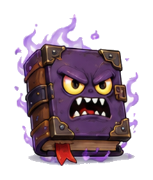

- Group: `enemies/cursed_book/walk`
- Canvas: 184x223
- Opaque bounds: (2, 2, 181, 220)
- Margins: left:2, right:2, top:2, bottom:2
- Warnings:
  - only 2px margin on left edge
  - only 2px margin on right edge
  - only 2px margin on top edge
  - only 2px margin on bottom edge
  - group canvas sizes differ: [179, 184] x [221, 223]

### `assets/enemies/cursed_book/walk_02.png`

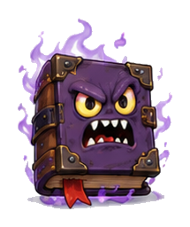

- Group: `enemies/cursed_book/walk`
- Canvas: 179x221
- Opaque bounds: (2, 2, 176, 218)
- Margins: left:2, right:2, top:2, bottom:2
- Warnings:
  - only 2px margin on left edge
  - only 2px margin on right edge
  - only 2px margin on top edge
  - only 2px margin on bottom edge
  - group canvas sizes differ: [179, 184] x [221, 223]

### `assets/enemies/snapping_vine/attack.png`

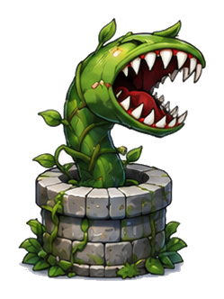

- Group: `enemies/snapping_vine/attack`
- Canvas: 213x297
- Opaque bounds: (2, 2, 210, 294)
- Margins: left:2, right:2, top:2, bottom:2
- Warnings:
  - only 2px margin on left edge
  - only 2px margin on right edge
  - only 2px margin on top edge
  - only 2px margin on bottom edge

### `assets/enemies/snapping_vine/retreat.png`

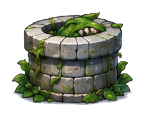

- Group: `enemies/snapping_vine/retreat`
- Canvas: 205x159
- Opaque bounds: (2, 2, 202, 156)
- Margins: left:2, right:2, top:2, bottom:2
- Warnings:
  - only 2px margin on left edge
  - only 2px margin on right edge
  - only 2px margin on top edge
  - only 2px margin on bottom edge

### `assets/enemies/snapping_vine/well_empty.png`

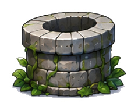

- Group: `enemies/snapping_vine/well_empty`
- Canvas: 201x155
- Opaque bounds: (2, 2, 198, 152)
- Margins: left:2, right:2, top:2, bottom:2
- Warnings:
  - only 2px margin on left edge
  - only 2px margin on right edge
  - only 2px margin on top edge
  - only 2px margin on bottom edge
