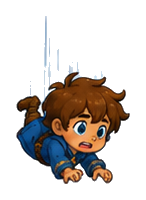
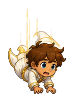

# Wizard Adventures Sprite Asset Audit

Generated by `python scripts/audit_sprites.py`.

This report flags measurable crop and alignment issues. It cannot prove that anatomy is artistically correct; frames with missing feet or body parts usually show up as edge-contact or tiny-margin warnings.

## Summary

- Files scanned: 84
- High priority: 60
- Medium priority: 2
- Low priority: 22
- No automatic warnings: 0

## HIGH Priority

### `assets/characters/finn/baby_fall.png`

- Group: `characters/finn/baby/fall`
- Canvas: 114x157
- Opaque bounds: (0, 0, 113, 156)
- Margins: left:0, right:0, top:0, bottom:0
- Warnings:
  - opaque pixels touch left edge
  - opaque pixels touch right edge
  - opaque pixels touch top edge
  - opaque pixels touch bottom edge

### `assets/characters/finn/baby_hurt.png`

- Group: `characters/finn/baby/hurt`
- Canvas: 153x145
- Opaque bounds: (0, 0, 152, 144)
- Margins: left:0, right:0, top:0, bottom:0
- Warnings:
  - opaque pixels touch left edge
  - opaque pixels touch right edge
  - opaque pixels touch top edge
  - opaque pixels touch bottom edge

### `assets/characters/finn/baby_idle_01.png`

- Group: `characters/finn/baby/idle`
- Canvas: 84x120
- Opaque bounds: (0, 0, 83, 119)
- Margins: left:0, right:0, top:0, bottom:0
- Warnings:
  - opaque pixels touch left edge
  - opaque pixels touch right edge
  - opaque pixels touch top edge
  - opaque pixels touch bottom edge
  - group canvas sizes differ: [73, 84] x [120]

### `assets/characters/finn/baby_idle_02.png`

- Group: `characters/finn/baby/idle`
- Canvas: 73x120
- Opaque bounds: (0, 0, 72, 119)
- Margins: left:0, right:0, top:0, bottom:0
- Warnings:
  - opaque pixels touch left edge
  - opaque pixels touch right edge
  - opaque pixels touch top edge
  - opaque pixels touch bottom edge
  - group canvas sizes differ: [73, 84] x [120]

### `assets/characters/finn/baby_jump.png`

- Group: `characters/finn/baby/jump`
- Canvas: 116x151
- Opaque bounds: (0, 0, 115, 150)
- Margins: left:0, right:0, top:0, bottom:0
- Warnings:
  - opaque pixels touch left edge
  - opaque pixels touch right edge
  - opaque pixels touch top edge
  - opaque pixels touch bottom edge

### `assets/characters/finn/baby_run_01.png`

- Group: `characters/finn/baby/run`
- Canvas: 109x107
- Opaque bounds: (0, 0, 108, 106)
- Margins: left:0, right:0, top:0, bottom:0
- Warnings:
  - opaque pixels touch left edge
  - opaque pixels touch right edge
  - opaque pixels touch top edge
  - opaque pixels touch bottom edge
  - group canvas sizes differ: [95, 109] x [99, 105, 107]
  - horizontal center differs from group median by +7.0px

### `assets/characters/finn/baby_run_02.png`

- Group: `characters/finn/baby/run`
- Canvas: 95x105
- Opaque bounds: (0, 0, 94, 104)
- Margins: left:0, right:0, top:0, bottom:0
- Warnings:
  - opaque pixels touch left edge
  - opaque pixels touch right edge
  - opaque pixels touch top edge
  - opaque pixels touch bottom edge
  - group canvas sizes differ: [95, 109] x [99, 105, 107]

### `assets/characters/finn/baby_run_03.png`

- Group: `characters/finn/baby/run`
- Canvas: 95x99
- Opaque bounds: (0, 0, 94, 98)
- Margins: left:0, right:0, top:0, bottom:0
- Warnings:
  - opaque pixels touch left edge
  - opaque pixels touch right edge
  - opaque pixels touch top edge
  - opaque pixels touch bottom edge
  - group canvas sizes differ: [95, 109] x [99, 105, 107]
  - baseline differs from group median by -6.0px

### `assets/characters/finn/baby_victory.png`

- Group: `characters/finn/baby/victory`
- Canvas: 101x127
- Opaque bounds: (0, 0, 100, 126)
- Margins: left:0, right:0, top:0, bottom:0
- Warnings:
  - opaque pixels touch left edge
  - opaque pixels touch right edge
  - opaque pixels touch top edge
  - opaque pixels touch bottom edge

### `assets/characters/finn/old_fall.png`

- Group: `characters/finn/old/fall`
- Canvas: 163x174
- Opaque bounds: (0, 0, 162, 173)
- Margins: left:0, right:0, top:0, bottom:0
- Warnings:
  - opaque pixels touch left edge
  - opaque pixels touch right edge
  - opaque pixels touch top edge
  - opaque pixels touch bottom edge

### `assets/characters/finn/old_hurt.png`

- Group: `characters/finn/old/hurt`
- Canvas: 163x196
- Opaque bounds: (0, 0, 162, 195)
- Margins: left:0, right:0, top:0, bottom:0
- Warnings:
  - opaque pixels touch left edge
  - opaque pixels touch right edge
  - opaque pixels touch top edge
  - opaque pixels touch bottom edge

### `assets/characters/finn/old_idle_01.png`

- Group: `characters/finn/old/idle`
- Canvas: 131x188
- Opaque bounds: (0, 0, 130, 187)
- Margins: left:0, right:0, top:0, bottom:0
- Warnings:
  - opaque pixels touch left edge
  - opaque pixels touch right edge
  - opaque pixels touch top edge
  - opaque pixels touch bottom edge
  - group canvas sizes differ: [131, 155] x [188, 191]
  - horizontal center differs from group median by -6.0px

### `assets/characters/finn/old_idle_02.png`

- Group: `characters/finn/old/idle`
- Canvas: 155x191
- Opaque bounds: (0, 0, 154, 190)
- Margins: left:0, right:0, top:0, bottom:0
- Warnings:
  - opaque pixels touch left edge
  - opaque pixels touch right edge
  - opaque pixels touch top edge
  - opaque pixels touch bottom edge
  - group canvas sizes differ: [131, 155] x [188, 191]
  - horizontal center differs from group median by +6.0px

### `assets/characters/finn/old_jump.png`

- Group: `characters/finn/old/jump`
- Canvas: 169x194
- Opaque bounds: (0, 0, 168, 193)
- Margins: left:0, right:0, top:0, bottom:0
- Warnings:
  - opaque pixels touch left edge
  - opaque pixels touch right edge
  - opaque pixels touch top edge
  - opaque pixels touch bottom edge

### `assets/characters/finn/old_run_01.png`

- Group: `characters/finn/old/run`
- Canvas: 168x177
- Opaque bounds: (0, 0, 167, 176)
- Margins: left:0, right:0, top:0, bottom:0
- Warnings:
  - opaque pixels touch left edge
  - opaque pixels touch right edge
  - opaque pixels touch top edge
  - opaque pixels touch bottom edge
  - group canvas sizes differ: [162, 168] x [172, 177]

### `assets/characters/finn/old_run_02.png`

- Group: `characters/finn/old/run`
- Canvas: 162x177
- Opaque bounds: (0, 0, 161, 176)
- Margins: left:0, right:0, top:0, bottom:0
- Warnings:
  - opaque pixels touch left edge
  - opaque pixels touch right edge
  - opaque pixels touch top edge
  - opaque pixels touch bottom edge
  - group canvas sizes differ: [162, 168] x [172, 177]

### `assets/characters/finn/old_run_03.png`

- Group: `characters/finn/old/run`
- Canvas: 168x172
- Opaque bounds: (0, 0, 167, 171)
- Margins: left:0, right:0, top:0, bottom:0
- Warnings:
  - opaque pixels touch left edge
  - opaque pixels touch right edge
  - opaque pixels touch top edge
  - opaque pixels touch bottom edge
  - group canvas sizes differ: [162, 168] x [172, 177]
  - baseline differs from group median by -5.0px

### `assets/characters/finn/old_victory.png`

- Group: `characters/finn/old/victory`
- Canvas: 109x187
- Opaque bounds: (0, 0, 108, 186)
- Margins: left:0, right:0, top:0, bottom:0
- Warnings:
  - opaque pixels touch left edge
  - opaque pixels touch right edge
  - opaque pixels touch top edge
  - opaque pixels touch bottom edge

### `assets/characters/finn/white_fall.png`

- Group: `characters/finn/white/fall`
- Canvas: 173x173
- Opaque bounds: (0, 0, 172, 172)
- Margins: left:0, right:0, top:0, bottom:0
- Warnings:
  - opaque pixels touch left edge
  - opaque pixels touch right edge
  - opaque pixels touch top edge
  - opaque pixels touch bottom edge

### `assets/characters/finn/white_hurt.png`

- Group: `characters/finn/white/hurt`
- Canvas: 168x195
- Opaque bounds: (0, 0, 167, 194)
- Margins: left:0, right:0, top:0, bottom:0
- Warnings:
  - opaque pixels touch left edge
  - opaque pixels touch right edge
  - opaque pixels touch top edge
  - opaque pixels touch bottom edge

### `assets/characters/finn/white_idle_01.png`

- Group: `characters/finn/white/idle`
- Canvas: 156x172
- Opaque bounds: (0, 0, 155, 171)
- Margins: left:0, right:0, top:0, bottom:0
- Warnings:
  - opaque pixels touch left edge
  - opaque pixels touch right edge
  - opaque pixels touch top edge
  - opaque pixels touch bottom edge
  - group canvas sizes differ: [156, 163] x [172, 174]

### `assets/characters/finn/white_idle_02.png`

- Group: `characters/finn/white/idle`
- Canvas: 163x174
- Opaque bounds: (0, 0, 162, 173)
- Margins: left:0, right:0, top:0, bottom:0
- Warnings:
  - opaque pixels touch left edge
  - opaque pixels touch right edge
  - opaque pixels touch top edge
  - opaque pixels touch bottom edge
  - group canvas sizes differ: [156, 163] x [172, 174]

### `assets/characters/finn/white_jump.png`

- Group: `characters/finn/white/jump`
- Canvas: 168x235
- Opaque bounds: (0, 0, 167, 234)
- Margins: left:0, right:0, top:0, bottom:0
- Warnings:
  - opaque pixels touch left edge
  - opaque pixels touch right edge
  - opaque pixels touch top edge
  - opaque pixels touch bottom edge

### `assets/characters/finn/white_run_01.png`

- Group: `characters/finn/white/run`
- Canvas: 178x163
- Opaque bounds: (0, 0, 177, 162)
- Margins: left:0, right:0, top:0, bottom:0
- Warnings:
  - opaque pixels touch left edge
  - opaque pixels touch right edge
  - opaque pixels touch top edge
  - opaque pixels touch bottom edge
  - group canvas sizes differ: [168, 173, 178] x [160, 163, 212]

### `assets/characters/finn/white_run_02.png`

- Group: `characters/finn/white/run`
- Canvas: 168x160
- Opaque bounds: (0, 0, 167, 159)
- Margins: left:0, right:0, top:0, bottom:0
- Warnings:
  - opaque pixels touch left edge
  - opaque pixels touch right edge
  - opaque pixels touch top edge
  - opaque pixels touch bottom edge
  - group canvas sizes differ: [168, 173, 178] x [160, 163, 212]

### `assets/characters/finn/white_run_03.png`

- Group: `characters/finn/white/run`
- Canvas: 173x212
- Opaque bounds: (0, 0, 172, 211)
- Margins: left:0, right:0, top:0, bottom:0
- Warnings:
  - opaque pixels touch left edge
  - opaque pixels touch right edge
  - opaque pixels touch top edge
  - opaque pixels touch bottom edge
  - group canvas sizes differ: [168, 173, 178] x [160, 163, 212]
  - baseline differs from group median by +49.0px

### `assets/characters/finn/white_victory.png`

- Group: `characters/finn/white/victory`
- Canvas: 151x153
- Opaque bounds: (0, 0, 150, 152)
- Margins: left:0, right:0, top:0, bottom:0
- Warnings:
  - opaque pixels touch left edge
  - opaque pixels touch right edge
  - opaque pixels touch top edge
  - opaque pixels touch bottom edge

### `assets/characters/nora/baby_fall.png`

- Group: `characters/nora/baby/fall`
- Canvas: 106x172
- Opaque bounds: (2, 0, 103, 169)
- Margins: left:2, right:2, top:0, bottom:2
- Warnings:
  - only 2px margin on left edge
  - only 2px margin on right edge
  - opaque pixels touch top edge
  - only 2px margin on bottom edge

### `assets/characters/nora/baby_hurt.png`

- Group: `characters/nora/baby/hurt`
- Canvas: 116x161
- Opaque bounds: (2, 0, 113, 158)
- Margins: left:2, right:2, top:0, bottom:2
- Warnings:
  - only 2px margin on left edge
  - only 2px margin on right edge
  - opaque pixels touch top edge
  - only 2px margin on bottom edge

### `assets/characters/nora/baby_victory.png`

- Group: `characters/nora/baby/victory`
- Canvas: 118x166
- Opaque bounds: (2, 0, 115, 163)
- Margins: left:2, right:2, top:0, bottom:2
- Warnings:
  - only 2px margin on left edge
  - only 2px margin on right edge
  - opaque pixels touch top edge
  - only 2px margin on bottom edge

### `assets/characters/nora/old_fall.png`

- Group: `characters/nora/old/fall`
- Canvas: 150x232
- Opaque bounds: (0, 2, 147, 229)
- Margins: left:0, right:2, top:2, bottom:2
- Warnings:
  - opaque pixels touch left edge
  - only 2px margin on right edge
  - only 2px margin on top edge
  - only 2px margin on bottom edge

### `assets/characters/nora/old_hurt.png`

- Group: `characters/nora/old/hurt`
- Canvas: 124x161
- Opaque bounds: (2, 0, 121, 158)
- Margins: left:2, right:2, top:0, bottom:2
- Warnings:
  - only 2px margin on left edge
  - only 2px margin on right edge
  - opaque pixels touch top edge
  - only 2px margin on bottom edge

### `assets/characters/nora/old_jump.png`

- Group: `characters/nora/old/jump`
- Canvas: 170x188
- Opaque bounds: (0, 2, 169, 185)
- Margins: left:0, right:0, top:2, bottom:2
- Warnings:
  - opaque pixels touch left edge
  - opaque pixels touch right edge
  - only 2px margin on top edge
  - only 2px margin on bottom edge

### `assets/characters/nora/old_run_01.png`

- Group: `characters/nora/old/run`
- Canvas: 169x191
- Opaque bounds: (2, 2, 168, 188)
- Margins: left:2, right:0, top:2, bottom:2
- Warnings:
  - only 2px margin on left edge
  - opaque pixels touch right edge
  - only 2px margin on top edge
  - only 2px margin on bottom edge
  - group canvas sizes differ: [164, 167, 169] x [184, 191, 203]

### `assets/characters/nora/old_run_02.png`

- Group: `characters/nora/old/run`
- Canvas: 164x184
- Opaque bounds: (0, 2, 161, 181)
- Margins: left:0, right:2, top:2, bottom:2
- Warnings:
  - opaque pixels touch left edge
  - only 2px margin on right edge
  - only 2px margin on top edge
  - only 2px margin on bottom edge
  - group canvas sizes differ: [164, 167, 169] x [184, 191, 203]
  - baseline differs from group median by -7.0px

### `assets/characters/nora/old_run_03.png`

- Group: `characters/nora/old/run`
- Canvas: 167x203
- Opaque bounds: (0, 0, 166, 200)
- Margins: left:0, right:0, top:0, bottom:2
- Warnings:
  - opaque pixels touch left edge
  - opaque pixels touch right edge
  - opaque pixels touch top edge
  - only 2px margin on bottom edge
  - group canvas sizes differ: [164, 167, 169] x [184, 191, 203]
  - baseline differs from group median by +12.0px

### `assets/characters/nora/white_fall.png`

- Group: `characters/nora/white/fall`
- Canvas: 157x192
- Opaque bounds: (0, 0, 156, 189)
- Margins: left:0, right:0, top:0, bottom:2
- Warnings:
  - opaque pixels touch left edge
  - opaque pixels touch right edge
  - opaque pixels touch top edge
  - only 2px margin on bottom edge

### `assets/characters/nora/white_hurt.png`

- Group: `characters/nora/white/hurt`
- Canvas: 127x154
- Opaque bounds: (0, 0, 126, 151)
- Margins: left:0, right:0, top:0, bottom:2
- Warnings:
  - opaque pixels touch left edge
  - opaque pixels touch right edge
  - opaque pixels touch top edge
  - only 2px margin on bottom edge

### `assets/characters/nora/white_idle_01.png`

- Group: `characters/nora/white/idle`
- Canvas: 159x175
- Opaque bounds: (2, 2, 158, 172)
- Margins: left:2, right:0, top:2, bottom:2
- Warnings:
  - only 2px margin on left edge
  - opaque pixels touch right edge
  - only 2px margin on top edge
  - only 2px margin on bottom edge
  - group canvas sizes differ: [159, 161] x [175, 176]

### `assets/characters/nora/white_idle_02.png`

- Group: `characters/nora/white/idle`
- Canvas: 161x176
- Opaque bounds: (0, 2, 160, 173)
- Margins: left:0, right:0, top:2, bottom:2
- Warnings:
  - opaque pixels touch left edge
  - opaque pixels touch right edge
  - only 2px margin on top edge
  - only 2px margin on bottom edge
  - group canvas sizes differ: [159, 161] x [175, 176]

### `assets/characters/nora/white_jump.png`

- Group: `characters/nora/white/jump`
- Canvas: 160x196
- Opaque bounds: (0, 2, 159, 195)
- Margins: left:0, right:0, top:2, bottom:0
- Warnings:
  - opaque pixels touch left edge
  - opaque pixels touch right edge
  - only 2px margin on top edge
  - opaque pixels touch bottom edge

### `assets/characters/nora/white_run_01.png`

- Group: `characters/nora/white/run`
- Canvas: 181x173
- Opaque bounds: (0, 2, 180, 170)
- Margins: left:0, right:0, top:2, bottom:2
- Warnings:
  - opaque pixels touch left edge
  - opaque pixels touch right edge
  - only 2px margin on top edge
  - only 2px margin on bottom edge
  - group canvas sizes differ: [177, 181, 184] x [169, 171, 173]

### `assets/characters/nora/white_run_02.png`

- Group: `characters/nora/white/run`
- Canvas: 184x169
- Opaque bounds: (0, 2, 183, 166)
- Margins: left:0, right:0, top:2, bottom:2
- Warnings:
  - opaque pixels touch left edge
  - opaque pixels touch right edge
  - only 2px margin on top edge
  - only 2px margin on bottom edge
  - group canvas sizes differ: [177, 181, 184] x [169, 171, 173]

### `assets/characters/nora/white_run_03.png`

- Group: `characters/nora/white/run`
- Canvas: 177x171
- Opaque bounds: (0, 2, 176, 168)
- Margins: left:0, right:0, top:2, bottom:2
- Warnings:
  - opaque pixels touch left edge
  - opaque pixels touch right edge
  - only 2px margin on top edge
  - only 2px margin on bottom edge
  - group canvas sizes differ: [177, 181, 184] x [169, 171, 173]

### `assets/characters/nora/white_victory.png`

- Group: `characters/nora/white/victory`
- Canvas: 137x197
- Opaque bounds: (0, 2, 136, 194)
- Margins: left:0, right:0, top:2, bottom:2
- Warnings:
  - opaque pixels touch left edge
  - opaque pixels touch right edge
  - only 2px margin on top edge
  - only 2px margin on bottom edge

### `assets/enemies/cursed_book/angry_idle.png`

- Group: `enemies/cursed_book/angry_idle`
- Canvas: 185x243
- Opaque bounds: (2, 0, 182, 240)
- Margins: left:2, right:2, top:0, bottom:2
- Warnings:
  - only 2px margin on left edge
  - only 2px margin on right edge
  - opaque pixels touch top edge
  - only 2px margin on bottom edge

### `assets/enemies/cursed_scroll_rocket/launcher.png`

- Group: `enemies/cursed_scroll_rocket/launcher`
- Canvas: 157x99
- Opaque bounds: (0, 0, 156, 98)
- Margins: left:0, right:0, top:0, bottom:0
- Warnings:
  - opaque pixels touch left edge
  - opaque pixels touch right edge
  - opaque pixels touch top edge
  - opaque pixels touch bottom edge

### `assets/enemies/cursed_scroll_rocket/rocket_01.png`

- Group: `enemies/cursed_scroll_rocket/rocket`
- Canvas: 186x215
- Opaque bounds: (0, 0, 185, 214)
- Margins: left:0, right:0, top:0, bottom:0
- Warnings:
  - opaque pixels touch left edge
  - opaque pixels touch right edge
  - opaque pixels touch top edge
  - opaque pixels touch bottom edge
  - group canvas sizes differ: [186, 208] x [215, 248]
  - baseline differs from group median by -16.5px
  - horizontal center differs from group median by -5.5px

### `assets/enemies/cursed_scroll_rocket/rocket_02.png`

- Group: `enemies/cursed_scroll_rocket/rocket`
- Canvas: 208x248
- Opaque bounds: (0, 0, 207, 247)
- Margins: left:0, right:0, top:0, bottom:0
- Warnings:
  - opaque pixels touch left edge
  - opaque pixels touch right edge
  - opaque pixels touch top edge
  - opaque pixels touch bottom edge
  - group canvas sizes differ: [186, 208] x [215, 248]
  - baseline differs from group median by +16.5px
  - horizontal center differs from group median by +5.5px

### `assets/enemies/goblin_spell_thrower/hurt.png`

- Group: `enemies/goblin_spell_thrower/hurt`
- Canvas: 197x261
- Opaque bounds: (0, 0, 196, 260)
- Margins: left:0, right:0, top:0, bottom:0
- Warnings:
  - opaque pixels touch left edge
  - opaque pixels touch right edge
  - opaque pixels touch top edge
  - opaque pixels touch bottom edge

### `assets/enemies/goblin_spell_thrower/idle.png`

- Group: `enemies/goblin_spell_thrower/idle`
- Canvas: 215x228
- Opaque bounds: (0, 0, 214, 227)
- Margins: left:0, right:0, top:0, bottom:0
- Warnings:
  - opaque pixels touch left edge
  - opaque pixels touch right edge
  - opaque pixels touch top edge
  - opaque pixels touch bottom edge

### `assets/enemies/goblin_spell_thrower/jump.png`

- Group: `enemies/goblin_spell_thrower/jump`
- Canvas: 250x251
- Opaque bounds: (0, 0, 249, 250)
- Margins: left:0, right:0, top:0, bottom:0
- Warnings:
  - opaque pixels touch left edge
  - opaque pixels touch right edge
  - opaque pixels touch top edge
  - opaque pixels touch bottom edge

### `assets/enemies/goblin_spell_thrower/orb_01.png`

- Group: `enemies/goblin_spell_thrower/orb`
- Canvas: 149x94
- Opaque bounds: (0, 0, 148, 93)
- Margins: left:0, right:0, top:0, bottom:0
- Warnings:
  - opaque pixels touch left edge
  - opaque pixels touch right edge
  - opaque pixels touch top edge
  - opaque pixels touch bottom edge
  - group canvas sizes differ: [149, 222] x [94, 98]
  - horizontal center differs from group median by -18.2px

### `assets/enemies/goblin_spell_thrower/orb_02.png`

- Group: `enemies/goblin_spell_thrower/orb`
- Canvas: 222x98
- Opaque bounds: (0, 0, 221, 97)
- Margins: left:0, right:0, top:0, bottom:0
- Warnings:
  - opaque pixels touch left edge
  - opaque pixels touch right edge
  - opaque pixels touch top edge
  - opaque pixels touch bottom edge
  - group canvas sizes differ: [149, 222] x [94, 98]
  - horizontal center differs from group median by +18.2px

### `assets/enemies/goblin_spell_thrower/throw.png`

- Group: `enemies/goblin_spell_thrower/throw`
- Canvas: 284x221
- Opaque bounds: (0, 0, 283, 220)
- Margins: left:0, right:0, top:0, bottom:0
- Warnings:
  - opaque pixels touch left edge
  - opaque pixels touch right edge
  - opaque pixels touch top edge
  - opaque pixels touch bottom edge

### `assets/enemies/owl_helper/flap_01.png`

- Group: `enemies/owl_helper/flap`
- Canvas: 223x176
- Opaque bounds: (0, 0, 222, 175)
- Margins: left:0, right:0, top:0, bottom:0
- Warnings:
  - opaque pixels touch left edge
  - opaque pixels touch right edge
  - opaque pixels touch top edge
  - opaque pixels touch bottom edge
  - group canvas sizes differ: [223, 263] x [162, 176]
  - baseline differs from group median by +7.0px
  - horizontal center differs from group median by -10.0px

### `assets/enemies/owl_helper/flap_02.png`

- Group: `enemies/owl_helper/flap`
- Canvas: 263x162
- Opaque bounds: (0, 0, 262, 161)
- Margins: left:0, right:0, top:0, bottom:0
- Warnings:
  - opaque pixels touch left edge
  - opaque pixels touch right edge
  - opaque pixels touch top edge
  - opaque pixels touch bottom edge
  - group canvas sizes differ: [223, 263] x [162, 176]
  - baseline differs from group median by -7.0px
  - horizontal center differs from group median by +10.0px

### `assets/enemies/owl_helper/hint_sign.png`

- Group: `enemies/owl_helper/hint_sign`
- Canvas: 226x215
- Opaque bounds: (0, 0, 225, 214)
- Margins: left:0, right:0, top:0, bottom:0
- Warnings:
  - opaque pixels touch left edge
  - opaque pixels touch right edge
  - opaque pixels touch top edge
  - opaque pixels touch bottom edge

### `assets/enemies/owl_helper/perched.png`

- Group: `enemies/owl_helper/perched`
- Canvas: 169x205
- Opaque bounds: (0, 0, 168, 204)
- Margins: left:0, right:0, top:0, bottom:0
- Warnings:
  - opaque pixels touch left edge
  - opaque pixels touch right edge
  - opaque pixels touch top edge
  - opaque pixels touch bottom edge

### `assets/enemies/owl_helper/point.png`

- Group: `enemies/owl_helper/point`
- Canvas: 223x194
- Opaque bounds: (0, 0, 222, 193)
- Margins: left:0, right:0, top:0, bottom:0
- Warnings:
  - opaque pixels touch left edge
  - opaque pixels touch right edge
  - opaque pixels touch top edge
  - opaque pixels touch bottom edge

## MEDIUM Priority

### `assets/enemies/snapping_vine/rise_01.png`

- Group: `enemies/snapping_vine/rise`
- Canvas: 203x219
- Opaque bounds: (2, 2, 200, 216)
- Margins: left:2, right:2, top:2, bottom:2
- Warnings:
  - only 2px margin on left edge
  - only 2px margin on right edge
  - only 2px margin on top edge
  - only 2px margin on bottom edge
  - group canvas sizes differ: [201, 203] x [219, 277]
  - baseline differs from group median by -29.0px

### `assets/enemies/snapping_vine/rise_02.png`

- Group: `enemies/snapping_vine/rise`
- Canvas: 201x277
- Opaque bounds: (2, 2, 198, 274)
- Margins: left:2, right:2, top:2, bottom:2
- Warnings:
  - only 2px margin on left edge
  - only 2px margin on right edge
  - only 2px margin on top edge
  - only 2px margin on bottom edge
  - group canvas sizes differ: [201, 203] x [219, 277]
  - baseline differs from group median by +29.0px

## LOW Priority

### `assets/characters/nora/baby_idle_01.png`

- Group: `characters/nora/baby/idle`
- Canvas: 114x159
- Opaque bounds: (2, 2, 111, 156)
- Margins: left:2, right:2, top:2, bottom:2
- Warnings:
  - only 2px margin on left edge
  - only 2px margin on right edge
  - only 2px margin on top edge
  - only 2px margin on bottom edge
  - group canvas sizes differ: [111, 114] x [159]

### `assets/characters/nora/baby_idle_02.png`

- Group: `characters/nora/baby/idle`
- Canvas: 111x159
- Opaque bounds: (2, 2, 108, 156)
- Margins: left:2, right:2, top:2, bottom:2
- Warnings:
  - only 2px margin on left edge
  - only 2px margin on right edge
  - only 2px margin on top edge
  - only 2px margin on bottom edge
  - group canvas sizes differ: [111, 114] x [159]

### `assets/characters/nora/baby_jump.png`

- Group: `characters/nora/baby/jump`
- Canvas: 108x144
- Opaque bounds: (2, 2, 105, 141)
- Margins: left:2, right:2, top:2, bottom:2
- Warnings:
  - only 2px margin on left edge
  - only 2px margin on right edge
  - only 2px margin on top edge
  - only 2px margin on bottom edge

### `assets/characters/nora/baby_run_01.png`

- Group: `characters/nora/baby/run`
- Canvas: 112x153
- Opaque bounds: (2, 2, 109, 150)
- Margins: left:2, right:2, top:2, bottom:2
- Warnings:
  - only 2px margin on left edge
  - only 2px margin on right edge
  - only 2px margin on top edge
  - only 2px margin on bottom edge
  - group canvas sizes differ: [112, 120] x [153, 155]

### `assets/characters/nora/baby_run_02.png`

- Group: `characters/nora/baby/run`
- Canvas: 120x155
- Opaque bounds: (2, 2, 117, 152)
- Margins: left:2, right:2, top:2, bottom:2
- Warnings:
  - only 2px margin on left edge
  - only 2px margin on right edge
  - only 2px margin on top edge
  - only 2px margin on bottom edge
  - group canvas sizes differ: [112, 120] x [153, 155]

### `assets/characters/nora/baby_run_03.png`

- Group: `characters/nora/baby/run`
- Canvas: 120x155
- Opaque bounds: (2, 2, 117, 152)
- Margins: left:2, right:2, top:2, bottom:2
- Warnings:
  - only 2px margin on left edge
  - only 2px margin on right edge
  - only 2px margin on top edge
  - only 2px margin on bottom edge
  - group canvas sizes differ: [112, 120] x [153, 155]

### `assets/characters/nora/old_idle_01.png`

- Group: `characters/nora/old/idle`
- Canvas: 137x193
- Opaque bounds: (2, 2, 134, 190)
- Margins: left:2, right:2, top:2, bottom:2
- Warnings:
  - only 2px margin on left edge
  - only 2px margin on right edge
  - only 2px margin on top edge
  - only 2px margin on bottom edge
  - group canvas sizes differ: [137, 140] x [193, 196]

### `assets/characters/nora/old_idle_02.png`

- Group: `characters/nora/old/idle`
- Canvas: 140x196
- Opaque bounds: (2, 2, 137, 193)
- Margins: left:2, right:2, top:2, bottom:2
- Warnings:
  - only 2px margin on left edge
  - only 2px margin on right edge
  - only 2px margin on top edge
  - only 2px margin on bottom edge
  - group canvas sizes differ: [137, 140] x [193, 196]

### `assets/characters/nora/old_victory.png`

- Group: `characters/nora/old/victory`
- Canvas: 123x204
- Opaque bounds: (2, 2, 120, 201)
- Margins: left:2, right:2, top:2, bottom:2
- Warnings:
  - only 2px margin on left edge
  - only 2px margin on right edge
  - only 2px margin on top edge
  - only 2px margin on bottom edge

### `assets/characters/nora/white_cast_fireball.png`

- Group: `characters/nora/white/cast`
- Canvas: 146x57
- Opaque bounds: (2, 2, 143, 54)
- Margins: left:2, right:2, top:2, bottom:2
- Warnings:
  - only 2px margin on left edge
  - only 2px margin on right edge
  - only 2px margin on top edge
  - only 2px margin on bottom edge

### `assets/enemies/armored_beetle/flipped.png`

- Group: `enemies/armored_beetle/flipped`
- Canvas: 194x138
- Opaque bounds: (2, 2, 191, 135)
- Margins: left:2, right:2, top:2, bottom:2
- Warnings:
  - only 2px margin on left edge
  - only 2px margin on right edge
  - only 2px margin on top edge
  - only 2px margin on bottom edge

### `assets/enemies/armored_beetle/shell.png`

- Group: `enemies/armored_beetle/shell`
- Canvas: 177x115
- Opaque bounds: (2, 2, 174, 112)
- Margins: left:2, right:2, top:2, bottom:2
- Warnings:
  - only 2px margin on left edge
  - only 2px margin on right edge
  - only 2px margin on top edge
  - only 2px margin on bottom edge

### `assets/enemies/armored_beetle/slide.png`

- Group: `enemies/armored_beetle/slide`
- Canvas: 293x106
- Opaque bounds: (2, 2, 290, 103)
- Margins: left:2, right:2, top:2, bottom:2
- Warnings:
  - only 2px margin on left edge
  - only 2px margin on right edge
  - only 2px margin on top edge
  - only 2px margin on bottom edge

### `assets/enemies/armored_beetle/walk_01.png`

- Group: `enemies/armored_beetle/walk`
- Canvas: 203x161
- Opaque bounds: (2, 2, 200, 158)
- Margins: left:2, right:2, top:2, bottom:2
- Warnings:
  - only 2px margin on left edge
  - only 2px margin on right edge
  - only 2px margin on top edge
  - only 2px margin on bottom edge
  - group canvas sizes differ: [203, 206] x [156, 161]

### `assets/enemies/armored_beetle/walk_02.png`

- Group: `enemies/armored_beetle/walk`
- Canvas: 206x156
- Opaque bounds: (2, 2, 203, 153)
- Margins: left:2, right:2, top:2, bottom:2
- Warnings:
  - only 2px margin on left edge
  - only 2px margin on right edge
  - only 2px margin on top edge
  - only 2px margin on bottom edge
  - group canvas sizes differ: [203, 206] x [156, 161]

### `assets/enemies/cursed_book/fireball_hit.png`

- Group: `enemies/cursed_book/fireball_hit`
- Canvas: 280x209
- Opaque bounds: (2, 2, 277, 206)
- Margins: left:2, right:2, top:2, bottom:2
- Warnings:
  - only 2px margin on left edge
  - only 2px margin on right edge
  - only 2px margin on top edge
  - only 2px margin on bottom edge

### `assets/enemies/cursed_book/squashed.png`

- Group: `enemies/cursed_book/squashed`
- Canvas: 221x105
- Opaque bounds: (2, 2, 218, 102)
- Margins: left:2, right:2, top:2, bottom:2
- Warnings:
  - only 2px margin on left edge
  - only 2px margin on right edge
  - only 2px margin on top edge
  - only 2px margin on bottom edge

### `assets/enemies/cursed_book/walk_01.png`

- Group: `enemies/cursed_book/walk`
- Canvas: 184x223
- Opaque bounds: (2, 2, 181, 220)
- Margins: left:2, right:2, top:2, bottom:2
- Warnings:
  - only 2px margin on left edge
  - only 2px margin on right edge
  - only 2px margin on top edge
  - only 2px margin on bottom edge
  - group canvas sizes differ: [179, 184] x [221, 223]

### `assets/enemies/cursed_book/walk_02.png`

- Group: `enemies/cursed_book/walk`
- Canvas: 179x221
- Opaque bounds: (2, 2, 176, 218)
- Margins: left:2, right:2, top:2, bottom:2
- Warnings:
  - only 2px margin on left edge
  - only 2px margin on right edge
  - only 2px margin on top edge
  - only 2px margin on bottom edge
  - group canvas sizes differ: [179, 184] x [221, 223]

### `assets/enemies/snapping_vine/attack.png`

- Group: `enemies/snapping_vine/attack`
- Canvas: 213x297
- Opaque bounds: (2, 2, 210, 294)
- Margins: left:2, right:2, top:2, bottom:2
- Warnings:
  - only 2px margin on left edge
  - only 2px margin on right edge
  - only 2px margin on top edge
  - only 2px margin on bottom edge

### `assets/enemies/snapping_vine/retreat.png`

- Group: `enemies/snapping_vine/retreat`
- Canvas: 205x159
- Opaque bounds: (2, 2, 202, 156)
- Margins: left:2, right:2, top:2, bottom:2
- Warnings:
  - only 2px margin on left edge
  - only 2px margin on right edge
  - only 2px margin on top edge
  - only 2px margin on bottom edge

### `assets/enemies/snapping_vine/well_empty.png`

- Group: `enemies/snapping_vine/well_empty`
- Canvas: 201x155
- Opaque bounds: (2, 2, 198, 152)
- Margins: left:2, right:2, top:2, bottom:2
- Warnings:
  - only 2px margin on left edge
  - only 2px margin on right edge
  - only 2px margin on top edge
  - only 2px margin on bottom edge
